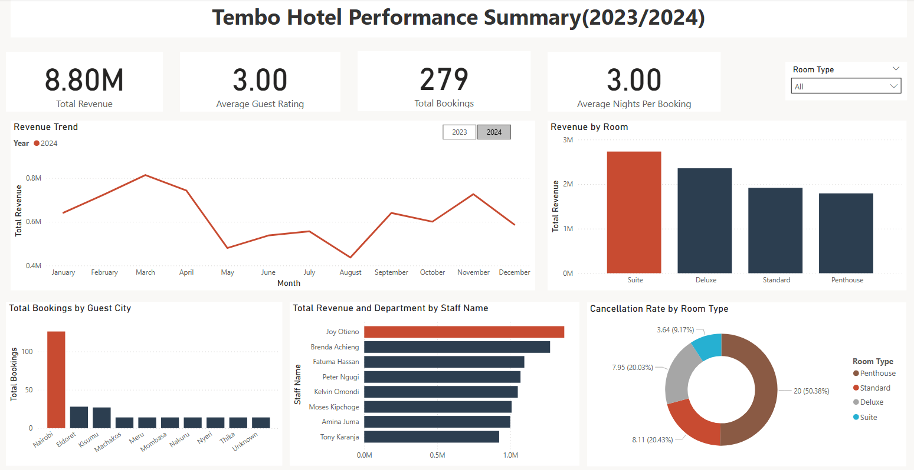

# Hotel Performance Analysis

This project involves cleaning, transforming, and analyzing hotel booking data using PostgreSQL, then building an interactive performance dashboard in Power BI to uncover operational and revenue insights.

## Objective
To analyze historical booking data to uncover revenue drivers, assess staff performance, and identify operational risks (such as cancellation rates), providing actionable insights.

## Tech Stack
- PostgreSQL
- Microsoft Power BI Desktop
- DBeaver / pgAdmin

## Project Workflow
PostgreSQL
1. Loaded and inspected raw hotel booking data
2. Cleaned and standardized inconsistent records
3. Created a production-ready table for analysis
4. Wrote analytical SQL queries
5. Built SQL views for reporting
6. Added indexes to optimize query performance

Power BI
1.  Connected Power BI to PostgreSQL
2.  Used SQL views as the reporting layer
3.  Built an interactive hotel performance dashboard

## Dashboard Features
- Revenue trend analysis
- Room type performance
- Staff performance tracking
- Cancellation analysis
- Guest distribution insights
- KPI overview


## Project Structure

```bash
├── hotel.sql
├── hotel_performance.pbix
├── readme.md
```

## Dashboard Preview
